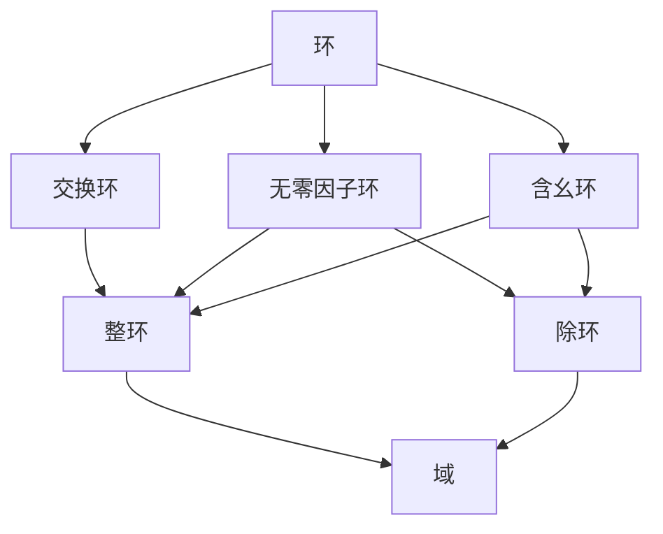

[TOC]

# 群

半群
$$
S是一个集合,\circ是集合上的一个二元运算,\\ 
1. \ \forall a,b \in S,a\circ b \in S \\
2. \ \forall a, b, c \in S , a\circ (b \circ c) = (a \circ b) \circ c \\
则G = (S, \circ)是一个半群
$$
​	

幺半群与单位元
$$
G是一个半群,\exists e \in G, \forall a \in G , e \circ a = a \circ e = a,则G是幺半群,e是单位元
$$

逆元
$$
G是一个幺半群, \exists a, b \in G, a\circ b = b \circ a = e, 则a与b互为逆元
$$
群
$$
G是一个幺半群,\forall a \in G, 有b\in G 使a\circ b = b \circ a = e,则G是一个群
$$

左单位元与右单位元
$$
\forall a \in G,有e\circ a = a, 则e是左单位元 \\
\forall a \in G,有a\circ e = a, 则e是右单位元
$$

左逆元与右逆元等价
$$
若e^L是左逆元,e^R是右逆元,则e^L\circ a = a \circ e^R = a \\
e^L = e^R = e
$$

有限群与无限群
$$
|G| < +\infty , 则G是有限群 \\
|G| = +\infty , 则G是无限群 \\
$$

交换群
$$
\forall a, b \in G, a \circ b = b \circ a, 则G是交换群
$$

次幂
$$
a \in G, a\circ a\circ \cdots \circ a = a^n
$$

次幂运算律
$$
a^{m + n} = a^m \circ a^n \\
(a^{m})^n = a^{mn} \\ 
G是交换群, (ab)^n = a^nb^n
$$

$$
(a_1\circ \cdots \circ a_n)^{-1} = a_n^{-1}\circ \cdots c_1^{-1}
$$

元素的阶
$$
a \in G, 若a^m = e, |a| = \min\{m\} \\
若\forall m \in Z^+, a^m \ne e,则 |a| = +\infty 
$$

$$
\forall a \in G, a^m = e, |a| = k \Rightarrow  k | m \\
\\
m = qk + p, p \in\{0, \cdots , k - 1\} \\
a^m = a^{qk} \circ a^p = a^p \ne e \\
\therefore q = k
$$

$$
\forall a \in G \Rightarrow |a| = |a^{-1}| \\
\\
a^{|a|} = e \\
(a^{-1})^{|a^{-1}|} = e \\
k = \min\{|a|, |a^{-1}|\} \\
a^{|a|} \circ (a^{-1})^{|a^{-1}|} = a^{|a| - k} = (a^{-1})^{|a^{-1}| - k} = e \\
\therefore |a| = |a^{-1}|
$$
有限群里阶大于2的元素个数是偶数
$$

$$

$$
(G,\circ)是一个群,(G', \cdot)是一个代数系统，若G \sim G',(G', \cdot)也是一个群 \\
\\
\forall a,b \in G,则f(a),f(b) \in G' \\
f(a\circ b) = f(a)\cdot f(b) \\
e\in G, e\circ a = a \circ e = a \\
f(e)\cdot f(a) = f(a) \cdot f(e) = f(a) \\
(a\circ b)\circ c = a\circ(b \circ c) \\
f((a\circ b) \circ c) = f(a\circ b)\cdot f(c) = (f(a) \cdot f(b))\cdot f(c) \\
f(a\circ (b \circ c)) = f(a) \cdot (f(b\circ c)) = f(a) \cdot (f(b) \cdot f(c)) \\
f(e) = f(a\circ a^{-1}) = f(a)\cdot f(a^{-1}) \Rightarrow f(a^{-1}) = f^{-1}(a) \\
$$

$$
S_3 = \{(1), (12), (13), (23), (123), (132)\} \\ \\
(1) = 
\left (
\begin{matrix}
1 \ 2 \ 3 \\
1 \ 2 \ 3 \\
\end{matrix}
\right )
\\ \\
(12) = 
\left (
\begin{matrix}
1 \ 2 \ 3 \\
2 \ 1 \ 3 \\
\end{matrix}
\right )
\\ \\
(13) = 
\left (
\begin{matrix}
1 \ 2 \ 3 \\
3 \ 2 \ 1 \\
\end{matrix}
\right )
\\ \\
(23) = 
\left (
\begin{matrix}
1 \ 2 \ 3 \\
1 \ 3 \ 2 \\
\end{matrix}
\right )
\\ \\
(123) = 
\left (
\begin{matrix}
1 \ 2 \ 3 \\
2 \ 3 \ 1 \\
\end{matrix}
\right )
\\ \\
(132) = 
\left (
\begin{matrix}
1 \ 2 \ 3 \\
3 \ 1 \ 2 \\
\end{matrix}
\right )
\\ \\
$$

凯莱定理：任何一个群都同构与一个变换群
$$

$$

$$
\sigma_1 = 
\left (
\begin{matrix}
1 \ 2 \ 3 \ 4 \ 5 \ 6 \\
3 \ 1 \ 6 \ 4 \ 5 \ 2 \\
\end{matrix}
\right )
= (1362)
\\ \\
\sigma_2 = 
\left (
\begin{matrix}
1 \ 2 \ 3 \ 4 \ 5 \ 6 \\
1 \ 2 \ 4 \ 3 \ 5 \ 6 \\
\end{matrix}
\right )
= (34)
\\ \\
\sigma_1为4-循环,\sigma_2为2-循环或对换
$$

$$
|S_n| = n! 
$$
循环置换可以表示为若干对换乘积

$$
n\ge 2, S_n中奇置换与偶置换各占一半
$$

$$
(i_1\cdots i_k)^{-1} = (i_k\cdots i_1) 
$$

生成元
$$
a \in G, \forall b \in G, 存在m\in \mathbb{Z},有b = a^m,则a是生成元,G是循环群,记为G(a) 
$$

模n剩余类
$$
[a], [b] \in \mathbb{Z}_n, [a] + [b] = [a + b]
$$

$$
G = G(a) \\
|a| = \infty \Rightarrow G \cong (\mathbb{Z}, +) \\
|a| = n \Rightarrow G \cong (\mathbb{Z}_n, +)
$$

$$
G = G(a) \\1
|a| = \infty \Rightarrow G恰有两个生成元a,a^{-1} \\
|a| = n \Rightarrow G至少有两个生成元a,a^{-1} \\
$$

$$
G是一个群,S是G的一个子群且是最小子群,则S是生成子群
$$

$$
H\le G, a \in G \\
aH = \{ah \vert h \in H\}是左陪集 \\
Ha = \{ha \vert h \in H\}是右陪集 \\
Ha = aH 则都为陪集
$$

$$
a \in aH \\
a \in Ha \\
a \in bH \Leftrightarrow aH = bH \Leftrightarrow a^{-1}b \in H \\
a \in Hb \Leftrightarrow Ha = Hb \Leftrightarrow ab^{-1} \in H \\
|H| = |aH| = |Ha|
$$

拉格朗日定理
$$
|G| < \infty , H \le G \Rightarrow [G:H] = \frac{|G|}{|H|}
$$

$$
|G| < \infty, a \in G \Rightarrow |a| | |G|
$$

$$
N \le G, \forall a \in G 有 \\
aN = Na  \\
则N是不变子群或正规子群
$$

$$
N = \{n \in G | na = an , a\in G\}, 则N\lhd G, 称为群的中心，记为C(G)
$$

$$
N \lhd G \Leftrightarrow \forall a \in G, aNa^{-1} = N  
$$

$$
N \lhd G \Leftrightarrow a\in G和n\in N,有ana^{-1} \in N
$$

$$
N \lhd G, G/N = \{aN, bN, \cdots\}是G关于不变子群N的陪集分解,\forall xN, yN \in G/N \\
xN\cdot yN = (xy)\cdot N \\
则G/N是G关于N的一个商群
$$

$$
G \sim G/H
$$

$$
G,G'是群,\phi:G\rightarrow G'是满同态,则\\
ker\phi = \{a \in G | \phi(a) = e'\} \\
是满同态\phi的核
$$

同态基本定理
$$
N = ker\phi \lhd G, G/N \cong G'
$$

$$
\phi: G \rightarrow G'是满同态 \\
H \le G \Rightarrow \phi(H) \le G' \\
N \lhd G \Rightarrow \phi(N) \lhd G' \\
H' \le G \Rightarrow \phi(H')^{-1} \le G \\
N' \lhd G \Rightarrow \phi(N')^{-1} \lhd G
$$

# 环和域

$$
R \ne \empty \\
(R, +)是群 \\
(R, \cdot)是半群 \\
满足左右结合律 c(a + b) = ca + cb, (a + b)c = ac + bc \\
则(R, +, \cdot)是一个环 \\
加群中单位元称为零元，逆元称为负元
$$

$$
乘法能够做交换群的环叫做域
$$

$$
模p剩余类域称为有限域
$$

$$
R是环,a,b\in R,a\ne 0, b\ne 0,若ab = 0,则a是坐零因子，b是右零因子，既是左零因子又是右零因子则为零因子
$$

$$
无零因子的环消去率成立
$$

$$
R满足乘法分配率则是交换环 \\
R有乘法单位元则R是含幺环 \\
R不含零因子则R是无零因子环 \\
若上述都满足则R是整环
$$

$$
R是一个环 \\
R至少有一个非零元 \\
R有乘法单位元 \\
R的每个非零元都有逆元 \\
则R是一个除环 \\
交换除环叫做域
$$

$$
F是域, a, b, c, d \in F \\
\frac{a}{b} = \frac{c}{d} \Leftrightarrow d = bc \\
\frac{a}{b} + \frac{c}{d} = \frac{ad + bc}{bd} \\
\frac{a}{b}\cdot \frac{c}{d} = \frac{ac}{bd}
$$

$$
R是无零因子环则R中所有非零元对于加法的阶都相同
$$

$$
无零因子环R的非零元的加法相同阶叫环的特征
$$

$$
无零因子环的特征是有限整数，则整个整数是素数
$$

$$
在特征为p的交换环中(a+b)^p = a^p + b^p
$$

$$
S \le R \Leftrightarrow \forall a,b \in S, a - b \in S, ab \in S \\
S \le R \Leftrightarrow \forall a, b \in S , a - b \in S, \forall a, b \in S, b \ne 0, ab^{-1} \in S 
$$

$$
\phi: R \rightarrow R' 是满同态 \\
零元的像是零元 \\
负元的像是负元 \\
单位元的像是单位元 \\
R是交换环R'也是交换环
$$

$$
R和R'是环，R\cong R' \\
R是整环R'也是 \\
R是除环R'也是 \\
R是域R'也是
$$

补足定理
$$
R,S'是环,S \le R, (R - S) \cap S' = \empty, S \cong S' 则存在R‘ \cong R , S' \le R'
$$

$$
\mathscr{U} \ne \empty \subseteq R\\
\forall a, b \in \mathscr{U}, a - b \in \mathscr{U} \\
a \in \mathscr{U}, r \in R, ra, ar \in \mathscr{U} \\
则\mathscr{U}是理想子环，简称理想，记做\mathscr{U} \lhd R
$$

$$
\{0\} \lhd R是零理想 \\
R \lhd R 是单位理想 \\
合称平凡理想
$$

$$
S = \{na | a \in R\} \lhd R
$$

$$
除环和域都是平凡理想
$$

$$
\mathscr{U}, \mathscr{B} \lhd R, \{\sum_{i = 1}^n x_iy_i \ | \ x_i \in \mathscr{U}, y_i \in \mathscr{B}, n \in \mathbb{Z}_+\} 是 R的理想，称为积理想，记为\mathscr{U}\mathscr{B}
$$

$$
a\in R, \{\sum_{i = 1}^m x_iay_i + sa + at + na \ | \ x_i, y_i, s, t \in R, n \in \mathbb{Z}\}是R的包含a的最小理想，记为(a),称为R的元a生成的主理想
$$

$$
R是交换环 \Rightarrow (a) = \{ra + na \ | \ r \in R, n \in \mathbb{Z}\} \\
R是含幺环 \Rightarrow (a) = \{\sum_{i = 1}^m x_i a y _i \ | \ x_i , y_i \in R\} \\
R是有单位元的交换环 \Rightarrow (a) = \{ra \ | \ r \in R\}
$$

$$
整数环的每个理想是它的主理想
$$

$$
\mathbb{Z}_n的理想都是主理想，并且\mathbb{Z}_n 的理想个数为n的正因子个数
$$

$$
a_1\cdots a_m \in R, \mathscr{U} = \{s_1 + s_2 +\cdots + s_m \ | \ s_i \in (a_i)\}, 则\mathscr{U}是R包含a_1\cdots a_m的最小理想,称为R的由a_1\cdots a_m确定的生成理想,记为(a_1, \cdots a_m)
$$

$$
A \lhd R,在商群(R, +) / (A, +) = \{[x] \ | \ x \in R\} = \{x + A \ | \ x \in R\}中 \\
[x] \cdot [y] = [xy], \forall [x], [y] \in R / A \\
则(R / A, +, \cdot)是一个环, R / A称为R关于理想A的商环或剩余类环
$$

$$
R \sim R / A
$$

$$
\phi : R \Rightarrow R' \\
ker \phi = \{x \in R \ | \ \phi(x) = 0' \}
$$

$$
\phi : R \rightarrow R'是满同态\\
ker \phi \lhd R \\
R/ker\phi \cong R' \\
A' \lhd R', A = \phi^{-1}(A') \Rightarrow A \lhd R, R/ A \cong R' / A'
$$

$$
\mathscr{U}是R的真理想,若除了R和\mathscr{U}自身没有包含\mathscr{U}的其他理想,则称\mathscr{U}是R的一个最大理想
$$

$$
\mathscr{U}是R的一个理想,则商环R' = R/\mathscr{U}只有平凡理想当且仅当\mathscr{U}是R的最大理想
$$

$$
有单位元的交换环只有平凡理想那么是域
$$

$$
R是有单位元的交换环,\mathscr{U}是R的理想,R/\mathscr{U}是域 \Leftrightarrow \mathscr{U}是一个最大理想
$$

$$
没有零因子的交换环都是一个域的子环
$$

